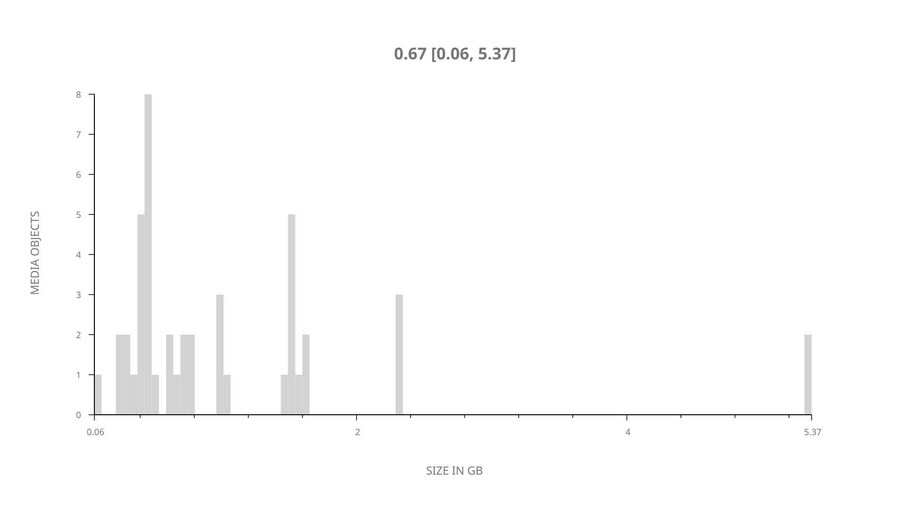
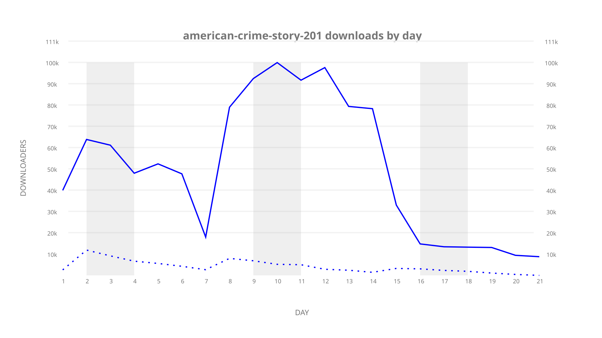
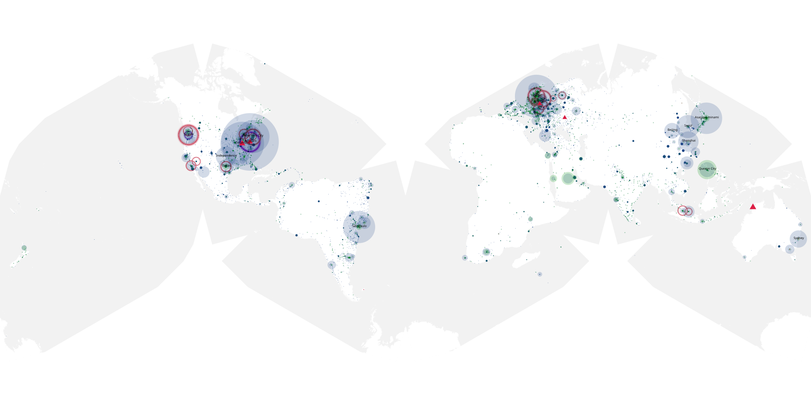
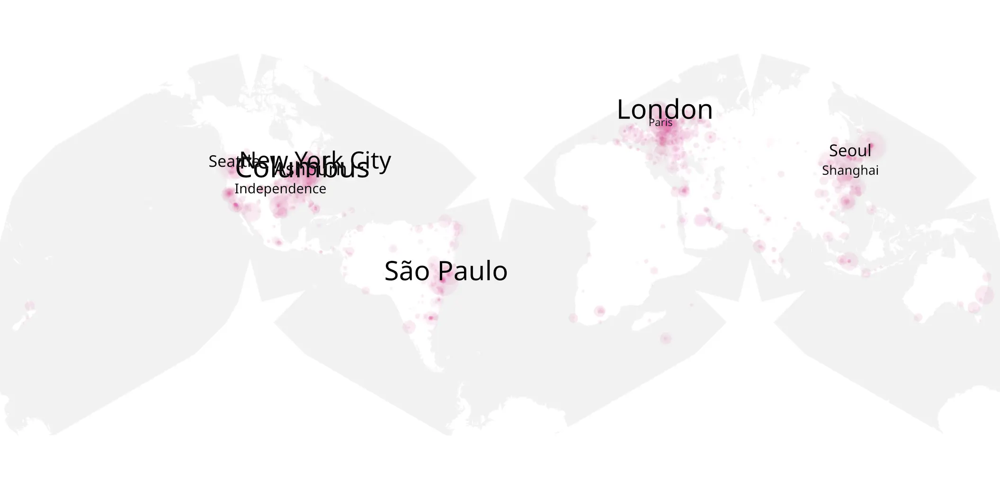
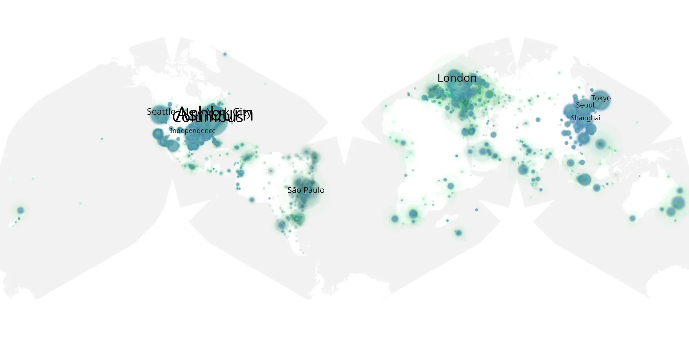

# american-crime-story-201 sample cache audit

## 1. Media object

| Field | Value |
| --- | --- |
| Media object | American Crime Story |
| Collection key | `american-crime-story-201` |
| imdb_id | [tt2788432](https://www.imdb.com/title/tt2788432/) |
| wikipedia_url | [American Crime Story](https://en.wikipedia.org/wiki/American_Crime_Story) |
| Sample dates | 2018-01-18-to-2018-02-07 |
| Sample days | 21 |
| BTIH count | 47 |
| Unique BTIH count | 45 |
| Downloaders total | 937,295 |
| Uploaders total | 184,429 |
| Data version | `2026-08-05` |
| IP geolocation version | `6:1777968300` |

## 2. Sample coverage report

- Generated: 2026-09-06T17:18:29Z
- Evidence: read-only Day-member stream of the selected cache archive; no raw sample contents were opened
- Selected archive: cache.20180207.tar.xz
- Required sample span: 2018-01-18 to 2018-02-07 (21 days)
- Cache Day products: 21
- Sparse Day indices: 0
- Post-release Day products: 0

### Sample archive discontinuities

None detected.

## 3. Media objects file size histogram

## 4. Visualization pass — graphs

### Downloads by week cumulative (normalized start)



### Downloads by day, Saturday and Sunday in gray

## 5. Visualization pass — maps

### Cumulative geographic slices

| Africa | Americas | Asia | Europe | Oceania | Unknown |
| --- | --- | --- | --- | --- | --- |
| 2.65 | 35.62 | 16.85 | 20.00 | 1.68 | 8.82 |

### Cumulative network infrastructure

{:target="_blank" rel="noopener"}

### Cumulative data maps

**Cumulative >= 1080p**

{:target="_blank" rel="noopener"}

**Cumulative < 1080p**

{:target="_blank" rel="noopener"}
