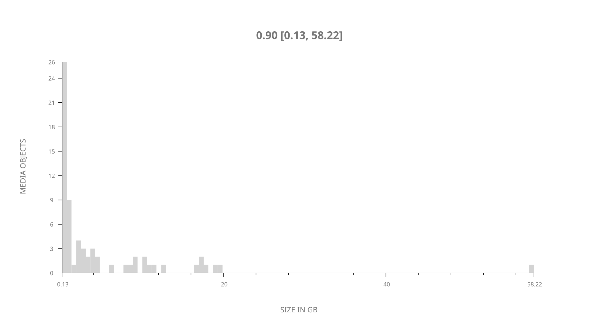
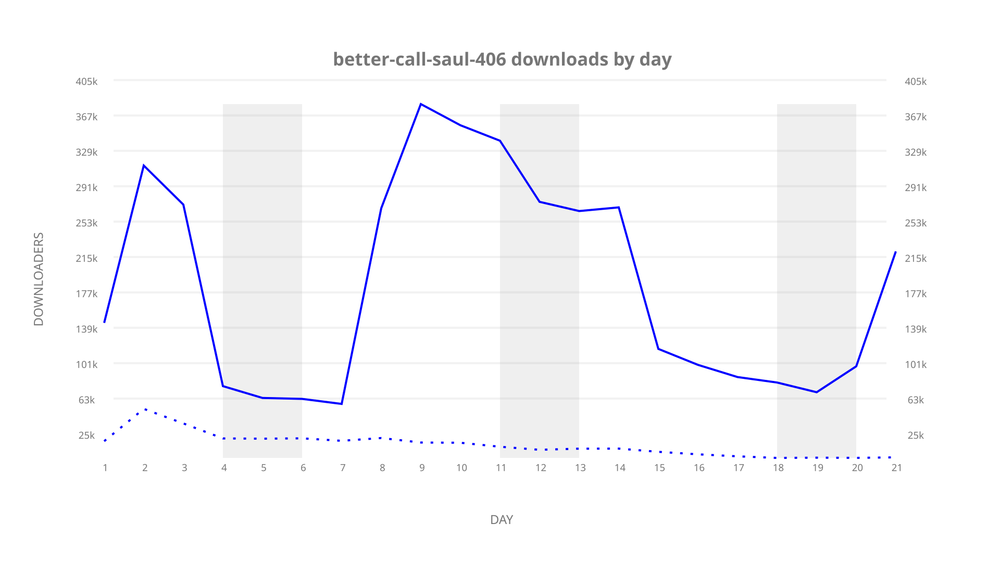
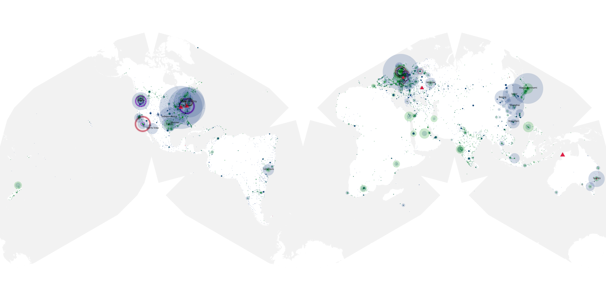
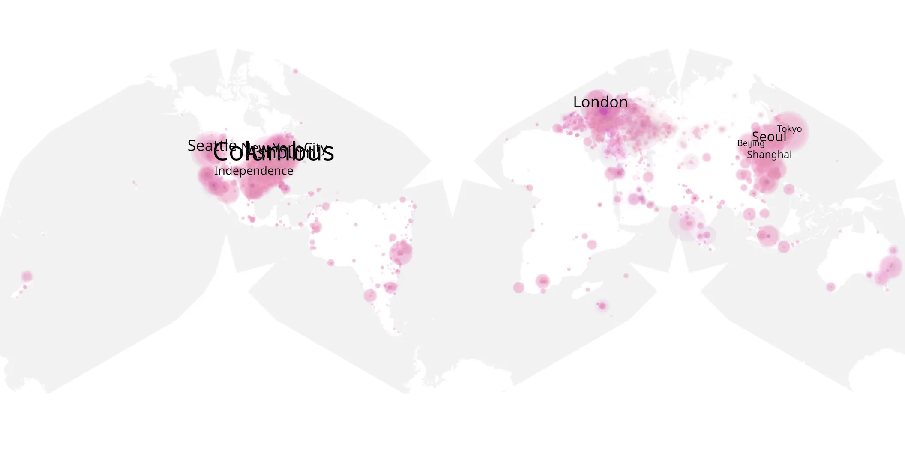
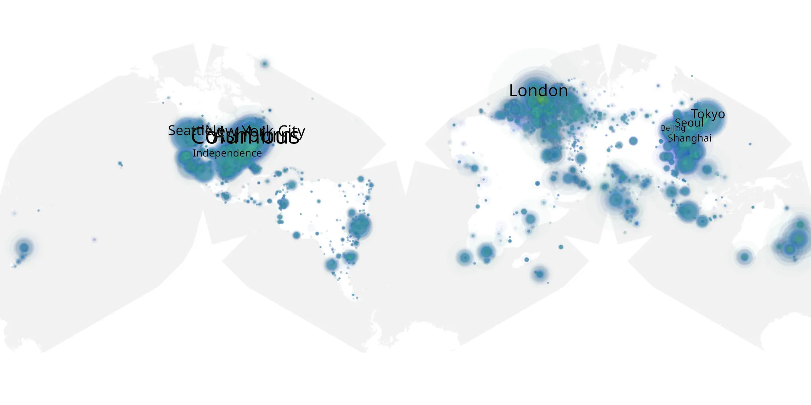

# better-call-saul-406 sample cache audit

## 1. Media object

| Field | Value |
| --- | --- |
| Media object | Better Call Saul |
| Collection key | `better-call-saul-406` |
| imdb_id | [tt3032476](https://www.imdb.com/title/tt3032476/) |
| wikipedia_url | [Better Call Saul](https://en.wikipedia.org/wiki/Better_Call_Saul) |
| Sample dates | 2018-09-11-to-2018-10-01 |
| Sample days | 21 |
| BTIH count | 81 |
| Unique BTIH count | 67 |
| Downloaders total | 3,360,795 |
| Uploaders total | 558,930 |
| Data version | `2026-08-05` |
| IP geolocation version | `6:1777968300` |

## 2. Sample coverage report

- Generated: 2026-09-06T17:18:29Z
- Evidence: read-only Day-member stream of the selected cache archive; no raw sample contents were opened
- Selected archive: cache.20181001.tar.xz
- Required sample span: 2018-09-11 to 2018-10-01 (21 days)
- Cache Day products: 21
- Sparse Day indices: 0
- Post-release Day products: 0

### Sample archive discontinuities

None detected.

## 3. Media objects file size histogram

## 4. Visualization pass — graphs

### Downloads by week cumulative (normalized start)



### Downloads by day, Saturday and Sunday in gray

## 5. Visualization pass — maps

### Cumulative geographic slices

| Africa | Americas | Asia | Europe | Oceania | Unknown |
| --- | --- | --- | --- | --- | --- |
| 2.57 | 35.84 | 18.86 | 21.62 | 2.17 | 10.33 |

### Cumulative network infrastructure

{:target="_blank" rel="noopener"}

### Cumulative data maps

**Cumulative >= 1080p**

{:target="_blank" rel="noopener"}

**Cumulative < 1080p**

{:target="_blank" rel="noopener"}
