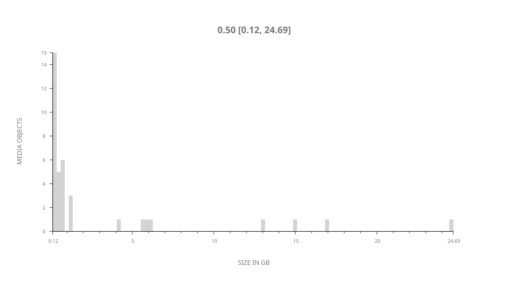
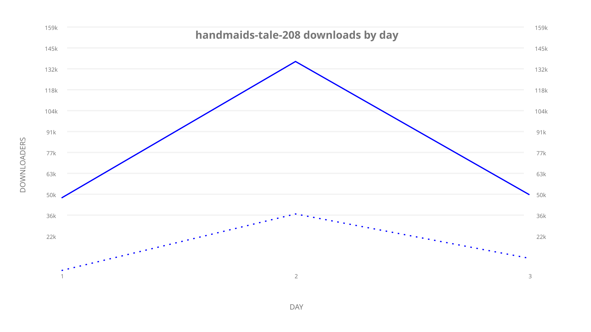
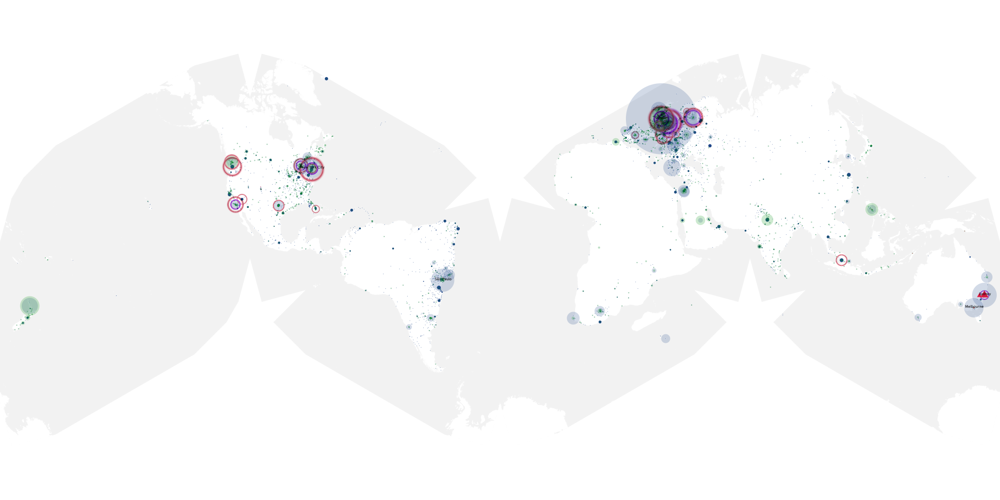
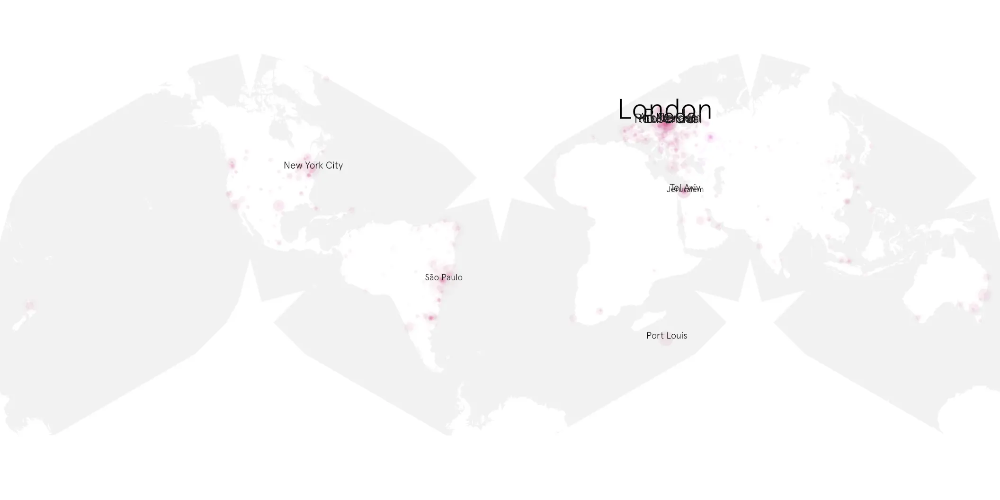
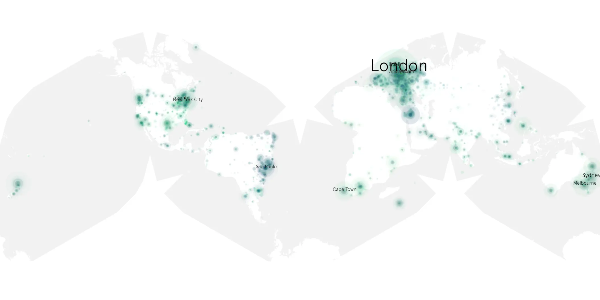

# handmaids-tale-208 sample cache audit

## 1. Media object

| Field | Value |
| --- | --- |
| Media object | The Handmaid's Tale |
| Collection key | `handmaids-tale-208` |
| imdb_id | [tt5834204](https://www.imdb.com/title/tt5834204/) |
| wikipedia_url | [The Handmaid's Tale (TV series)](https://en.wikipedia.org/wiki/The_Handmaid%27s_Tale_(TV_series)) |
| Sample dates | 2018-06-06-to-2018-06-08 |
| Sample days | 3 |
| BTIH count | 48 |
| Unique BTIH count | 37 |
| Downloaders total | 420,574 |
| Uploaders total | 120,992 |
| Data version | `2026-08-05` |
| IP geolocation version | `6:1777968300` |

## 2. Sample coverage report

- Generated: 2026-09-06T17:18:29Z
- Evidence: read-only Day-member stream of the selected cache archive; no raw sample contents were opened
- Selected archive: cache.20180608.tar.xz
- Required sample span: 2018-06-06 to 2018-06-08 (3 days)
- Cache Day products: 3
- Sparse Day indices: 0
- Post-release Day products: 0

### Sample archive discontinuities

None detected.

## 3. Media objects file size histogram

## 4. Visualization pass — graphs

### Downloads by week cumulative (normalized start)



### Downloads by day, Saturday and Sunday in gray

## 5. Visualization pass — maps

### Cumulative geographic slices

| Africa | Americas | Asia | Europe | Oceania | Unknown |
| --- | --- | --- | --- | --- | --- |
| 4.00 | 23.99 | 9.37 | 30.00 | 5.19 | 0.20 |

### Cumulative network infrastructure

{:target="_blank" rel="noopener"}

### Cumulative data maps

**Cumulative >= 1080p**

{:target="_blank" rel="noopener"}

**Cumulative < 1080p**

{:target="_blank" rel="noopener"}
