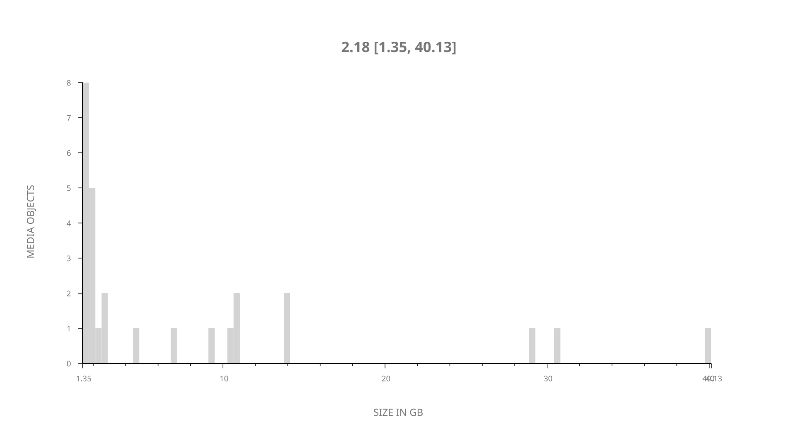
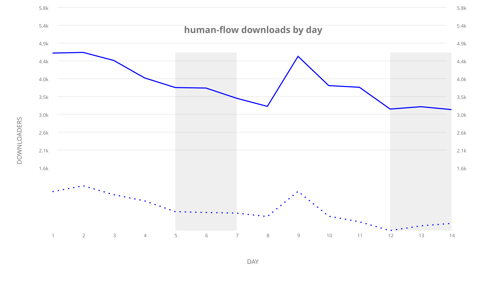
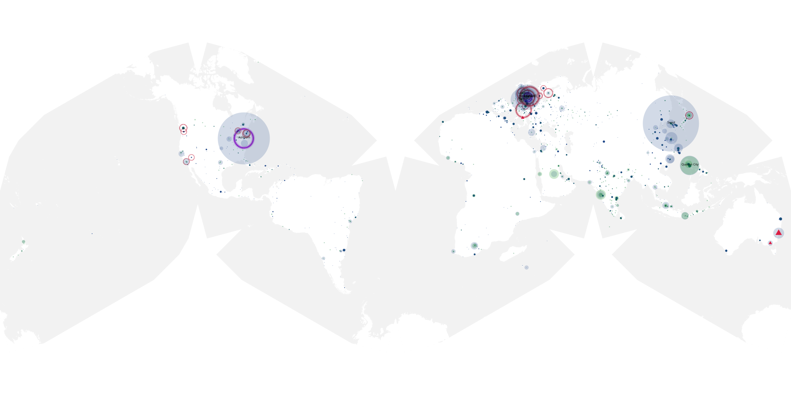
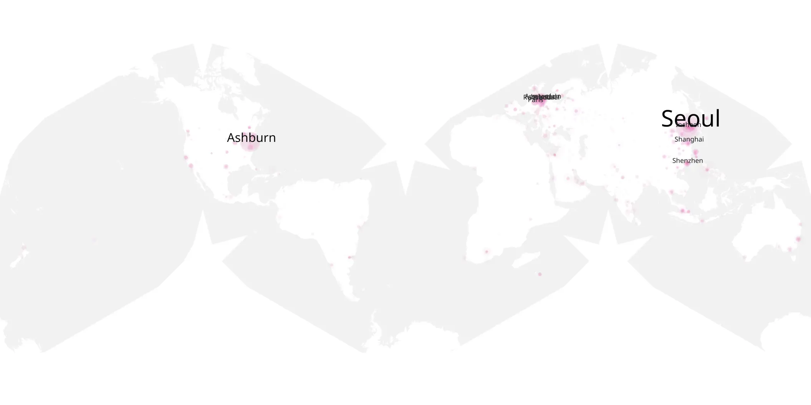
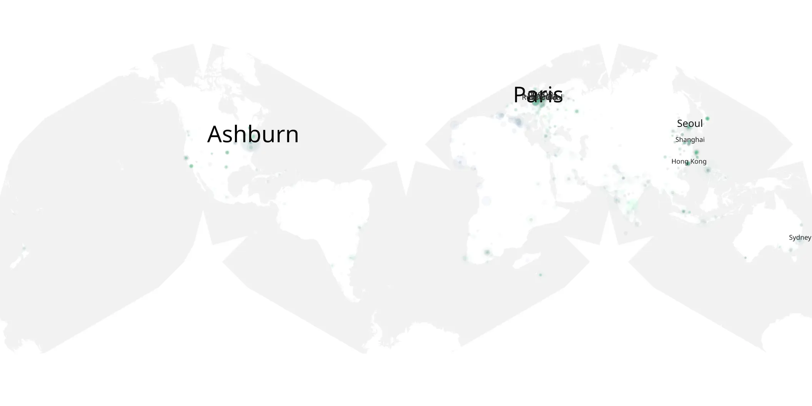

# human-flow sample cache audit

## 1. Media object

| Field | Value |
| --- | --- |
| Media object | Human Flow |
| Collection key | `human-flow` |
| imdb_id | [tt6573444](https://www.imdb.com/title/tt6573444/) |
| wikipedia_url | [Human Flow](https://en.wikipedia.org/wiki/Human_Flow) |
| Sample dates | 2018-04-09-to-2018-04-22 |
| Sample days | 14 |
| BTIH count | 39 |
| Unique BTIH count | 27 |
| Downloaders total | 67,795 |
| Uploaders total | 26,831 |
| Data version | `2026-08-05` |
| IP geolocation version | `6:1777968300` |

## 2. Sample coverage report

- Generated: 2026-09-06T17:18:29Z
- Evidence: read-only Day-member stream of the selected cache archive; no raw sample contents were opened
- Selected archive: cache.20180422.tar.xz
- Required sample span: 2018-04-09 to 2018-04-22 (14 days)
- Cache Day products: 14
- Sparse Day indices: 0
- Post-release Day products: 0

### Sample archive discontinuities

None detected.

## 3. Media objects file size histogram

## 4. Visualization pass — graphs

### Downloads by week cumulative (normalized start)



### Downloads by day, Saturday and Sunday in gray

## 5. Visualization pass — maps

### Cumulative geographic slices

| Africa | Americas | Asia | Europe | Oceania | Unknown |
| --- | --- | --- | --- | --- | --- |
| 5.64 | 16.25 | 28.71 | 23.96 | 2.30 | 1.92 |

### Cumulative network infrastructure

{:target="_blank" rel="noopener"}

### Cumulative data maps

**Cumulative >= 1080p**

{:target="_blank" rel="noopener"}

**Cumulative < 1080p**

{:target="_blank" rel="noopener"}
