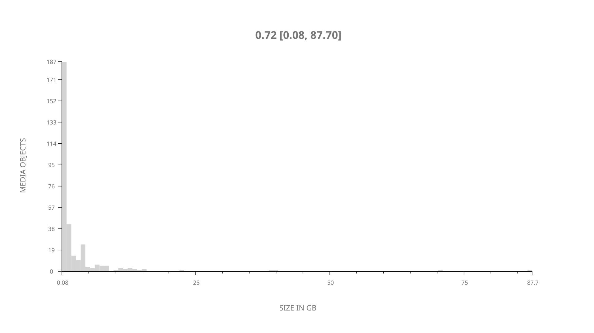
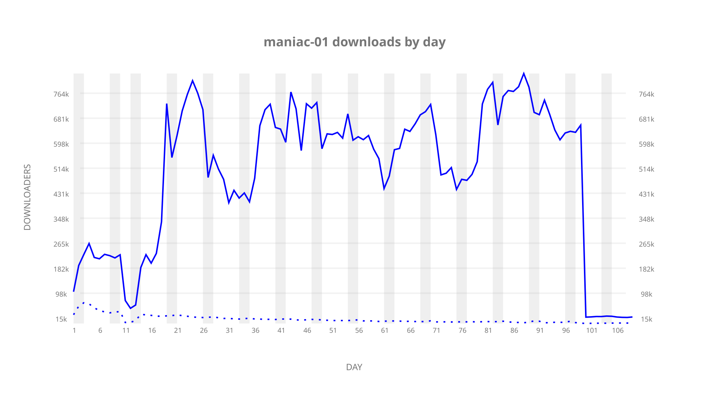
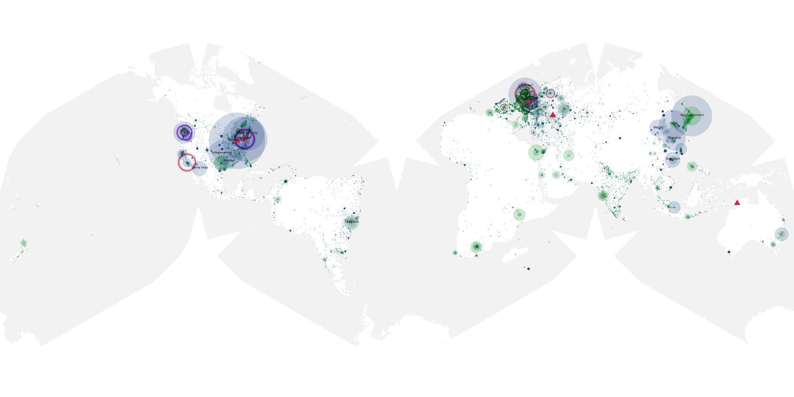
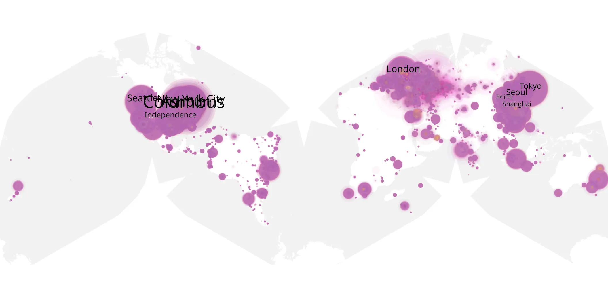
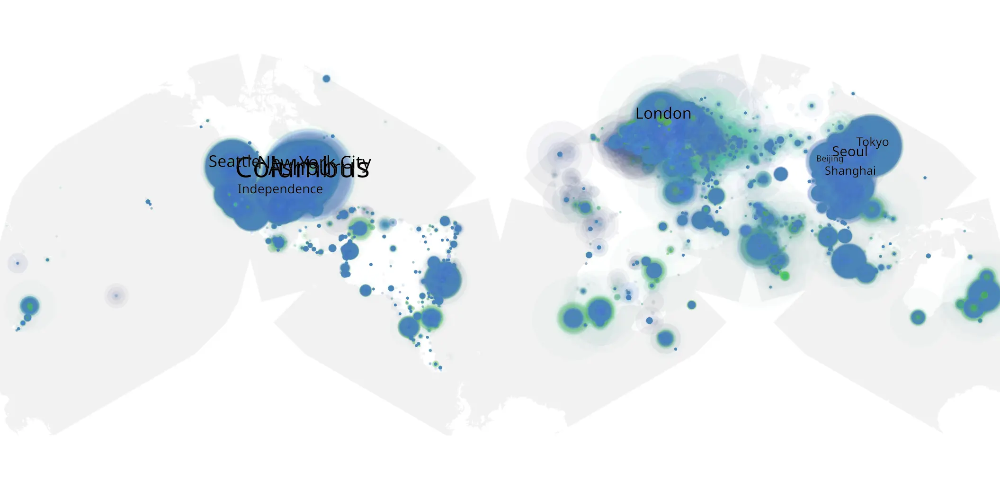

# maniac-01 sample cache audit

## 1. Media object

| Field | Value |
| --- | --- |
| Media object | Maniac |
| Collection key | `maniac-01` |
| imdb_id | [tt5580146](https://www.imdb.com/title/tt5580146/) |
| wikipedia_url | [Maniac (miniseries)](https://en.wikipedia.org/wiki/Maniac_(miniseries)) |
| Sample dates | 2018-09-21-to-2019-01-10 |
| Sample days | 112 |
| BTIH count | 329 |
| Unique BTIH count | 319 |
| Downloaders total | 14,616,922 |
| Uploaders total | 1,729,568 |
| Data version | `2026-08-05` |
| IP geolocation version | `6:1777968300` |

## 2. Sample coverage report

- Generated: 2026-09-06T17:18:29Z
- Evidence: read-only Day-member stream of the selected cache archive; no raw sample contents were opened
- Selected archive: cache.20190110.tar.xz
- Required sample span: 2018-09-21 to 2019-01-10 (112 days)
- Cache Day products: 109
- Sparse Day indices: 3
- Post-release Day products: 0

### Sample archive discontinuities

- missing Day index: 12
- missing Day index: 13
- missing Day index: 14

## 3. Media objects file size histogram

## 4. Visualization pass — graphs

### Downloads by week cumulative (normalized start)



### Downloads by day, Saturday and Sunday in gray

## 5. Visualization pass — maps

### Cumulative geographic slices

| Africa | Americas | Asia | Europe | Oceania | Unknown |
| --- | --- | --- | --- | --- | --- |
| 2.96 | 37.54 | 19.88 | 22.59 | 1.57 | 12.42 |

### Cumulative network infrastructure

{:target="_blank" rel="noopener"}

### Cumulative data maps

**Cumulative >= 1080p**

{:target="_blank" rel="noopener"}

**Cumulative < 1080p**

{:target="_blank" rel="noopener"}
