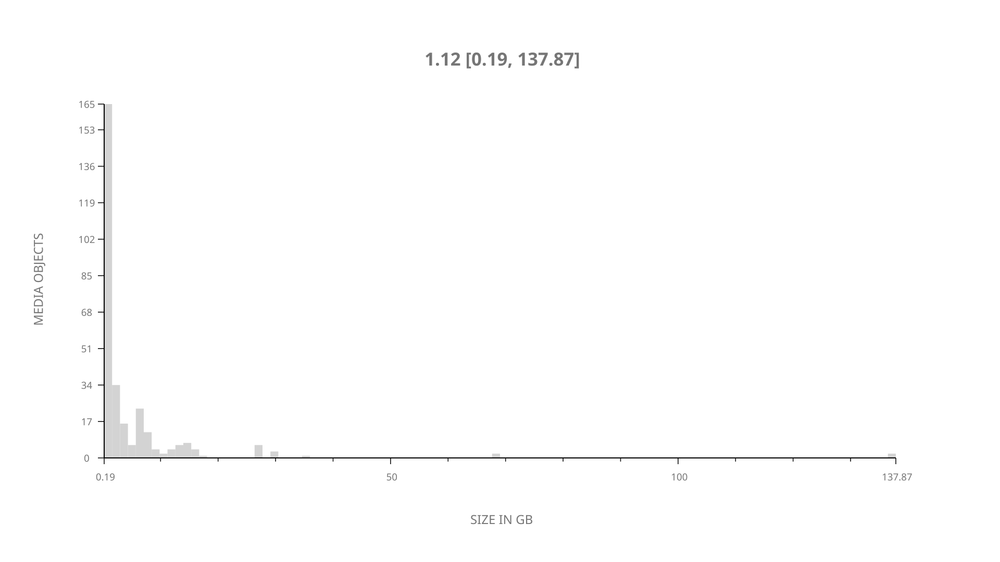
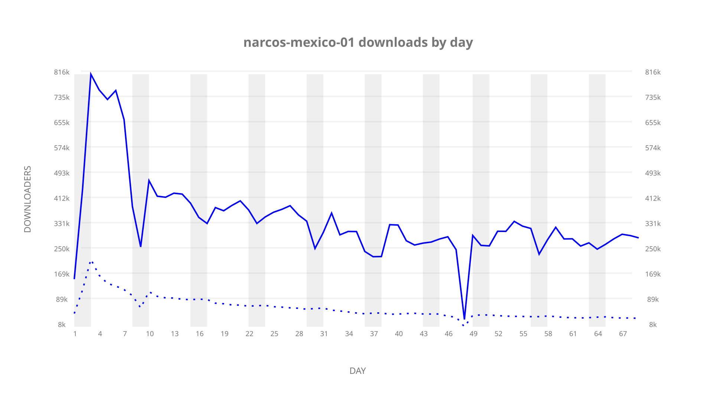
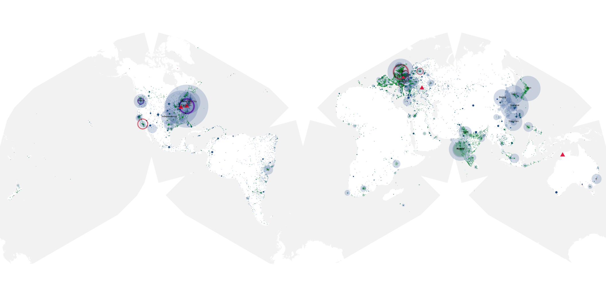
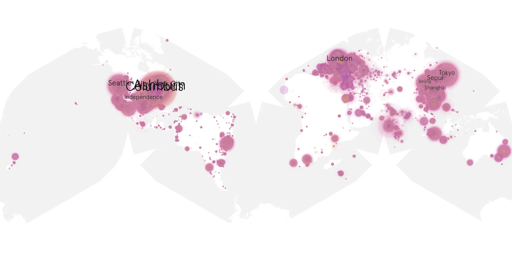
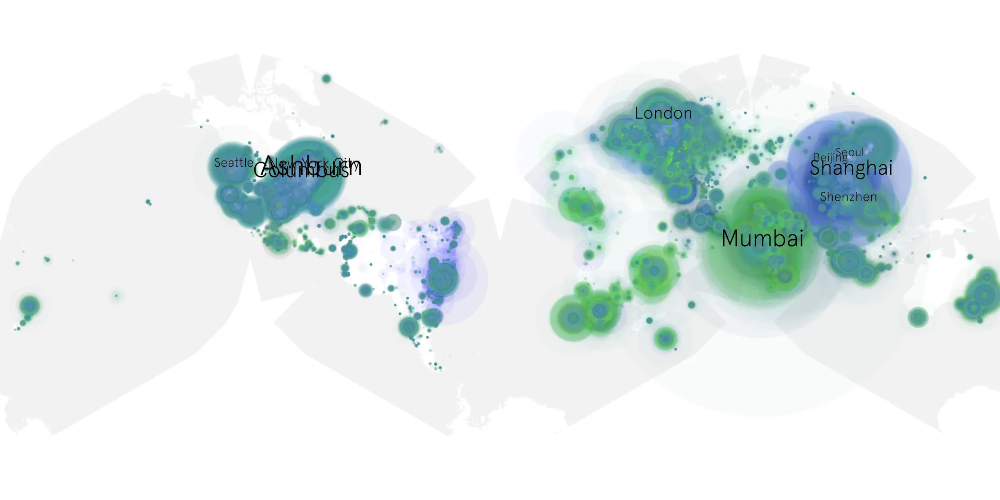

# narcos-mexico-01 sample cache audit

## 1. Media object

| Field | Value |
| --- | --- |
| Media object | Narcos Mexico |
| Collection key | `narcos-mexico-01` |
| imdb_id | [tt8714904](https://www.imdb.com/title/tt8714904/) |
| wikipedia_url | [Narcos: Mexico](https://en.wikipedia.org/wiki/Narcos:_Mexico) |
| Sample dates | 2018-11-16-to-2019-01-24 |
| Sample days | 70 |
| BTIH count | 320 |
| Unique BTIH count | 298 |
| Downloaders total | 14,859,079 |
| Uploaders total | 3,143,442 |
| Data version | `2026-08-05` |
| IP geolocation version | `6:1777968300` |

## 2. Sample coverage report

- Generated: 2026-09-06T17:18:29Z
- Evidence: read-only Day-member stream of the selected cache archive; no raw sample contents were opened
- Selected archive: cache.20190124.tar.xz
- Required sample span: 2018-11-16 to 2019-01-24 (70 days)
- Cache Day products: 69
- Sparse Day indices: 1
- Post-release Day products: 0

### Sample archive discontinuities

- missing Day index: 48

## 3. Media objects file size histogram

## 4. Visualization pass — graphs

### Downloads by week cumulative (normalized start)



### Downloads by day, Saturday and Sunday in gray

## 5. Visualization pass — maps

### Cumulative geographic slices

| Africa | Americas | Asia | Europe | Oceania | Unknown |
| --- | --- | --- | --- | --- | --- |
| 4.27 | 30.60 | 27.44 | 22.15 | 1.49 | 8.96 |

### Cumulative network infrastructure

{:target="_blank" rel="noopener"}

### Cumulative data maps

**Cumulative >= 1080p**

{:target="_blank" rel="noopener"}

**Cumulative < 1080p**

{:target="_blank" rel="noopener"}
