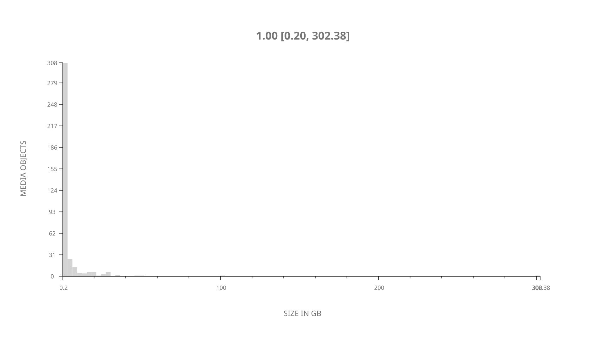
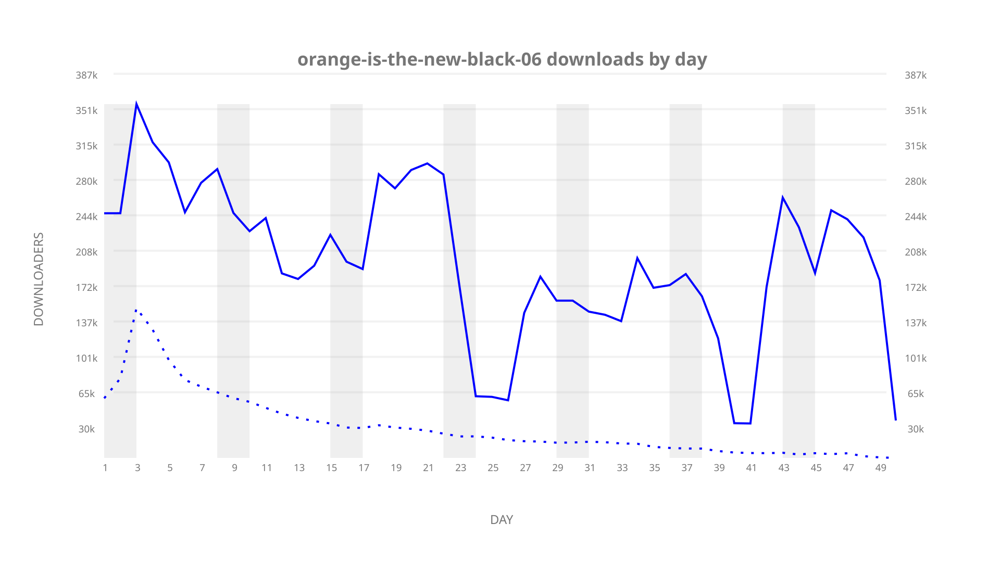
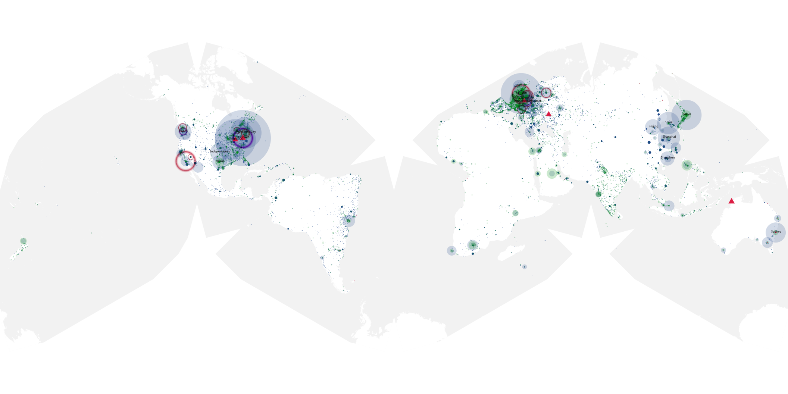
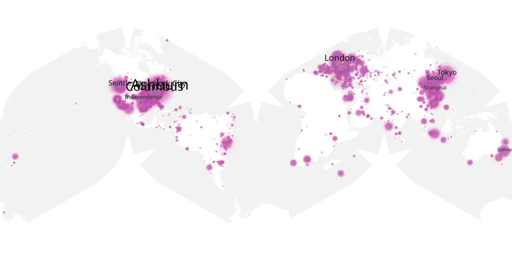
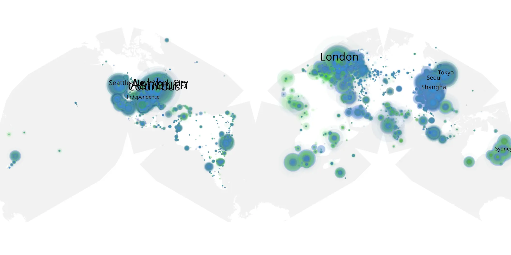

# orange-is-the-new-black-06 sample cache audit

## 1. Media object

| Field | Value |
| --- | --- |
| Media object | Orange Is The New Black |
| Collection key | `orange-is-the-new-black-06` |
| imdb_id | [tt2372162](https://www.imdb.com/title/tt2372162/) |
| wikipedia_url | [Orange Is the New Black](https://en.wikipedia.org/wiki/Orange_Is_the_New_Black) |
| Sample dates | 2018-07-27-to-2018-09-14 |
| Sample days | 50 |
| BTIH count | 422 |
| Unique BTIH count | 383 |
| Downloaders total | 7,680,227 |
| Uploaders total | 1,953,473 |
| Data version | `2026-08-05` |
| IP geolocation version | `6:1777968300` |

## 2. Sample coverage report

- Generated: 2026-09-06T17:18:29Z
- Evidence: read-only Day-member stream of the selected cache archive; no raw sample contents were opened
- Selected archive: cache.20180914.tar.xz
- Required sample span: 2018-07-27 to 2018-09-14 (50 days)
- Cache Day products: 50
- Sparse Day indices: 0
- Post-release Day products: 0

### Sample archive discontinuities

None detected.

## 3. Media objects file size histogram

## 4. Visualization pass — graphs

### Downloads by week cumulative (normalized start)



### Downloads by day, Saturday and Sunday in gray

## 5. Visualization pass — maps

### Cumulative geographic slices

| Africa | Americas | Asia | Europe | Oceania | Unknown |
| --- | --- | --- | --- | --- | --- |
| 4.53 | 35.24 | 19.90 | 25.20 | 2.97 | 9.54 |

### Cumulative network infrastructure

{:target="_blank" rel="noopener"}

### Cumulative data maps

**Cumulative >= 1080p**

{:target="_blank" rel="noopener"}

**Cumulative < 1080p**

{:target="_blank" rel="noopener"}
