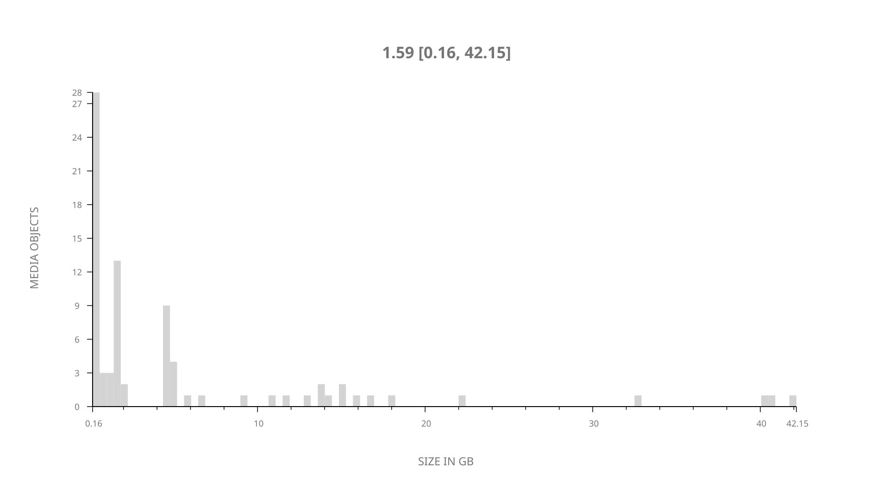
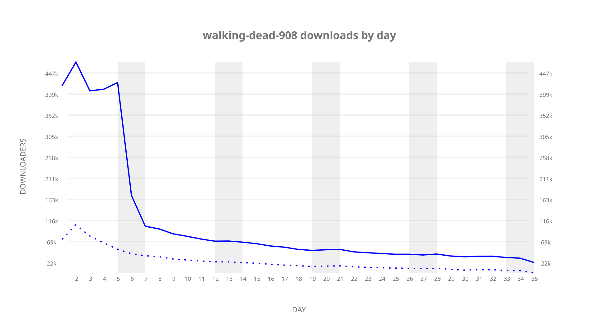
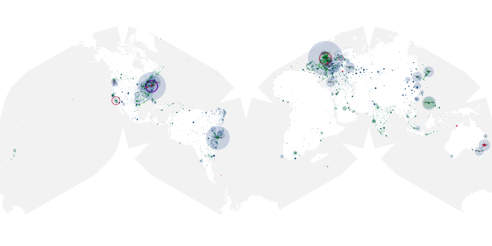
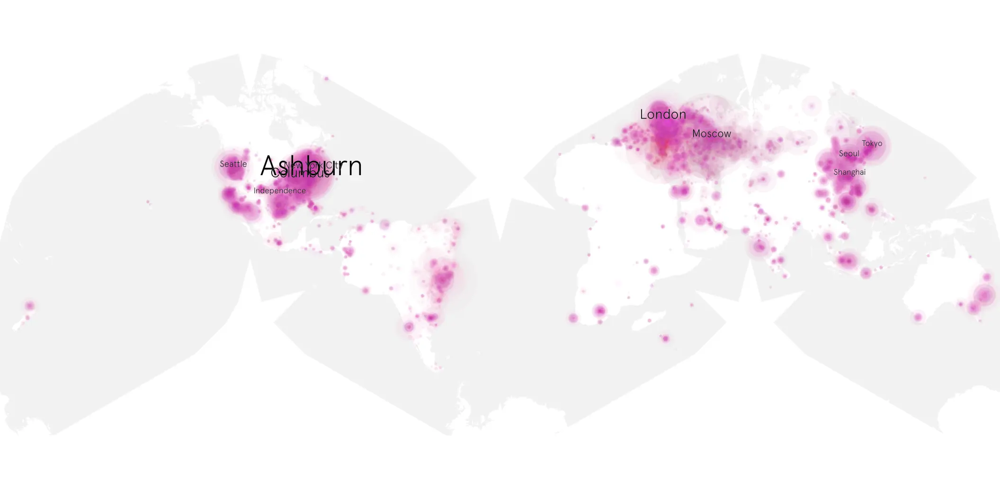
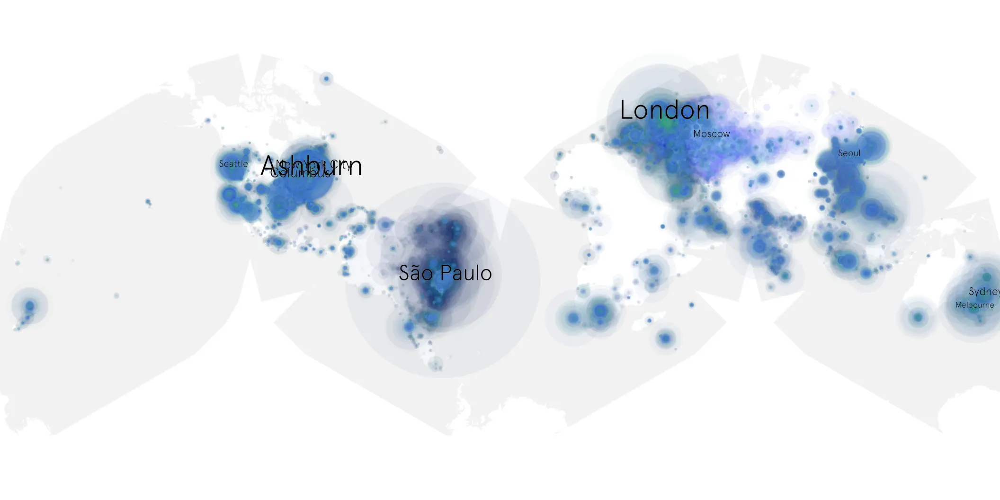

# walking-dead-908 sample cache audit

## 1. Media object

| Field | Value |
| --- | --- |
| Media object | The Walking Dead |
| Collection key | `walking-dead-908` |
| imdb_id | [tt1520211](https://www.imdb.com/title/tt1520211/) |
| wikipedia_url | [The Walking Dead (TV series)](https://en.wikipedia.org/wiki/The_Walking_Dead_(TV_series)) |
| Sample dates | 2018-11-26-to-2018-12-30 |
| Sample days | 35 |
| BTIH count | 97 |
| Unique BTIH count | 81 |
| Downloaders total | 4,313,029 |
| Uploaders total | 1,313,649 |
| Data version | `2026-08-05` |
| IP geolocation version | `6:1777968300` |

## 2. Sample coverage report

- Generated: 2026-09-06T17:18:29Z
- Evidence: read-only Day-member stream of the selected cache archive; no raw sample contents were opened
- Selected archive: cache.20181230.tar.xz
- Required sample span: 2018-11-26 to 2018-12-30 (35 days)
- Cache Day products: 35
- Sparse Day indices: 0
- Post-release Day products: 0

### Sample archive discontinuities

None detected.

## 3. Media objects file size histogram

## 4. Visualization pass — graphs

### Downloads by week cumulative (normalized start)



### Downloads by day, Saturday and Sunday in gray

## 5. Visualization pass — maps

### Cumulative geographic slices

| Africa | Americas | Asia | Europe | Oceania | Unknown |
| --- | --- | --- | --- | --- | --- |
| 3.16 | 34.39 | 16.90 | 27.65 | 2.99 | 5.07 |

### Cumulative network infrastructure

{:target="_blank" rel="noopener"}

### Cumulative data maps

**Cumulative >= 1080p**

{:target="_blank" rel="noopener"}

**Cumulative < 1080p**

{:target="_blank" rel="noopener"}
